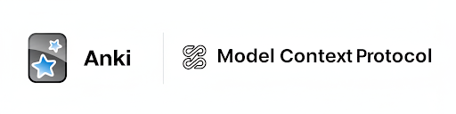

# Mankey - Anki MCP Server & CLI

MCP server and CLI for Anki integration via Anki-Connect. 96 tools across 8 categories for creating flashcards, managing reviews, analyzing learning data, and automating Anki workflows.



## Quick Start

### Prerequisites
1. **[Anki](https://apps.ankiweb.net/)** - Desktop application
2. **Anki-Connect** - Install via Anki > Tools > Add-ons > Get Add-ons > Code: `2055492159`

### MCP Server (Claude Desktop)

```json
{
  "mcpServers": {
    "anki": {
      "command": "npx",
      "args": ["mankey"]
    }
  }
}
```

### CLI

```bash
# List all decks
npx mankey deck list

# Create a note
npx mankey note add --deck Default --model Basic --front "Q" --back "A"

# Search notes
npx mankey note find "deck:Default"

# Run any of the 96 tools directly
npx mankey run findCards '{"query":"deck:Default is:due","limit":20}'

# List all available tools
npx mankey tools
```

## CLI Commands

### deck
| Command | Description |
|---------|-------------|
| `deck list` | List all deck names |
| `deck create <name>` | Create a deck (use `::` for nesting) |
| `deck stats <names...>` | Get new/learn/review/total counts |
| `deck delete <names...>` | Delete decks and their cards |

### note
| Command | Description |
|---------|-------------|
| `note add --deck D --model M --front F --back B [--tags t1,t2]` | Create a note |
| `note find <query> [--offset N] [--limit N]` | Search notes |
| `note info <ids...>` | Get note details |
| `note update <id> [--fields '{}'] [--tags t1,t2]` | Update a note |
| `note delete <ids...>` | Delete notes permanently |
| `note tags <id>` | Get tags for a note |

### card
| Command | Description |
|---------|-------------|
| `card find <query> [--offset N] [--limit N]` | Search cards |
| `card info <ids...>` | Get card details |
| `card suspend <ids...>` | Suspend cards |
| `card unsuspend <ids...>` | Unsuspend cards |
| `card answer <cardId> <ease>` | Answer card (1=Again 2=Hard 3=Good 4=Easy) |
| `card next [--deck D] [--limit N]` | Get next due cards in review order |

### model
| Command | Description |
|---------|-------------|
| `model list` | List all note types |
| `model fields <name>` | Get field names for a model |
| `model create --name N --fields f1,f2 --templates '<json>'` | Create model |

### stats
| Command | Description |
|---------|-------------|
| `stats today` | Today's review count |
| `stats due [--deck D]` | Due cards with learning/review breakdown |
| `stats collection` | Full collection statistics |

### Generic Runner

Any of the 96 tools can be called directly:

```bash
npx mankey run <toolName> '<jsonArgs>'
npx mankey run addNote '{"deckName":"Default","modelName":"Basic","fields":{"Front":"Hello","Back":"World"}}'
npx mankey run deckNames
```

## Tool Categories (96 tools)

| Category | Count | Examples |
|----------|-------|---------|
| Deck | 6 | deckNames, createDeck, getDeckStats, deleteDecks |
| Note | 16 | addNote, findNotes, notesInfo, updateNote, getTags |
| Card | 19 | findCards, getNextCards, cardsInfo, answerCards, suspend |
| Model | 9 | modelNames, modelFieldNames, createModel |
| Media | 5 | storeMediaFile, retrieveMediaFile, getMediaFilesNames |
| Stats | 7 | getNumCardsReviewedToday, getDueCardsDetailed |
| GUI | 17 | guiBrowse, guiAddCards, guiDeckReview |
| System | 17 | sync, exportPackage, importPackage, multi |

Run `npx mankey tools` for the full list, or `npx mankey tools --category deck` to filter.

## Key Features

- **96 tools** covering all Anki-Connect operations
- **CLI + MCP** - Every tool available as both CLI command and MCP tool
- **Pagination** - `offset`/`limit` on all list operations
- **Auto-batching** - Operations >100 items split automatically
- **Queue priority** - `getNextCards` respects Learning > Review > New order
- **Flexible input** - Tags/IDs accept arrays, strings, or JSON
- **TypeScript + Zod** - Full type safety and schema validation

## Configuration

| Option | Description |
|--------|-------------|
| `--url <url>` | Anki-Connect server URL |
| `ANKI_CONNECT_URL` | Environment variable (default: `http://127.0.0.1:8765`) |
| `ANKI_API_KEY` | Optional API key for Anki-Connect |

## Project Structure

```
mankey/
  bin/mankey.ts              # Bun development entry point
  src/
    main.ts                  # CLI entry point (compiles to dist/main.js)
    index.ts                 # MCP-only entry point
    shared/                  # Config, types, anki-connect client, normalization
    tools/                   # 96 tool definitions (8 category files)
    cli/                     # Commander.js subcommands
    mcp/                     # MCP server setup
  dist/                      # Compiled JS (shipped via npm)
  tests/                     # E2E integration tests
```

## Development

Requires [Bun](https://bun.sh) for development:

```bash
bun install
bun run dev                  # Watch mode MCP server
bun test                     # Run all tests
bun run build                # Compile to dist/
bun run typecheck            # Type check only
bun run lint                 # Lint with Biome
```

## Testing

Tests require Anki running with Anki-Connect installed:

```bash
bun test                     # All tests
bun test:e2e:basic           # Basic connectivity
bun test:e2e:tags            # Tag handling
bun test:e2e:pagination      # Pagination
bun test:e2e:queue           # Queue priority
```

## Troubleshooting

**Cannot connect**: Ensure Anki is running with Anki-Connect installed
**Permission dialog**: Click "Yes" on first connection
**macOS background**: Disable App Nap if needed:
```bash
defaults write net.ankiweb.dtop NSAppSleepDisabled -bool true
```

## Links

- [Anki-Connect Docs](https://github.com/FooSoft/anki-connect)
- [MCP Specification](https://modelcontextprotocol.io)
- [Anki Forums](https://forums.ankiweb.net)
- [Claude Desktop](https://claude.ai/download)

## License

MIT
